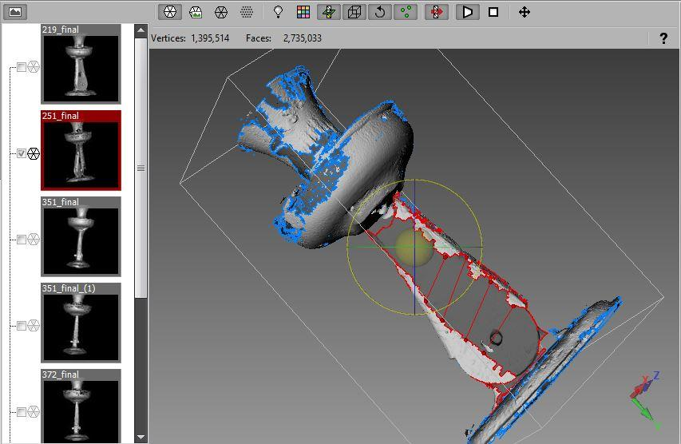
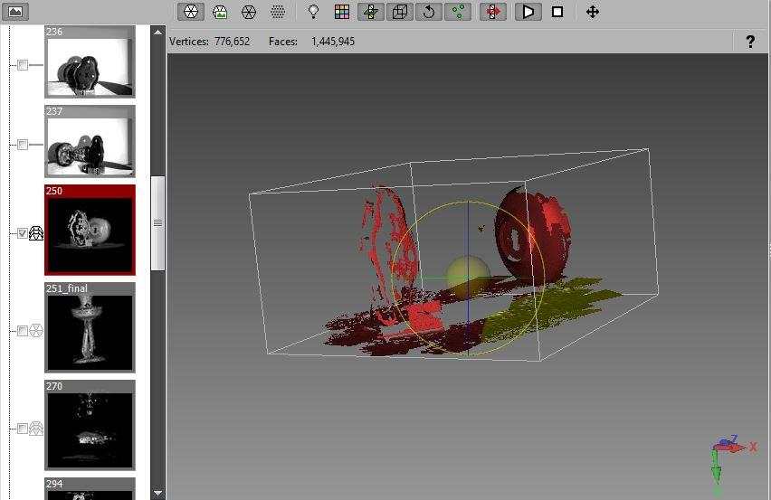
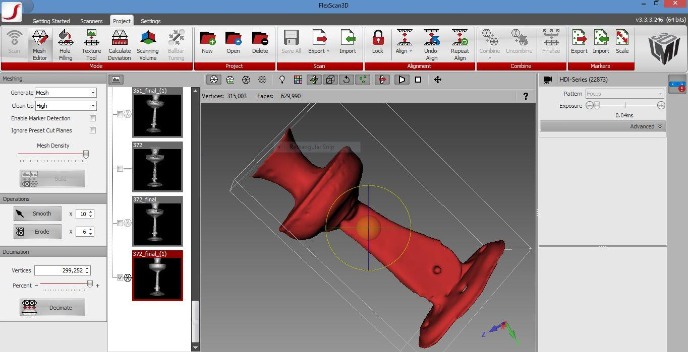

##What is structured light scanning?

From Wikipedia: "measuring the three-dimensional shape of an object using [projected light patterns](https://en.wikipedia.org/wiki/Structured_light) and a [camera](https://en.wikipedia.org/wiki/Camera) system."

The scanner projects light patterns (in this case, a checkerboard pattern) onto an object to determine the space between certain points on the object. Rather than stitching 2D images together after the fact (as Agisoft Photoscan does), the scanner creates meshes as it scans an object. 

##Workflow in short: 
1. Calibrate table 
2. Adjust exposure 
3. Scan object
4. Combine meshes
5. Fill holes
6. Export model 

##Workflow in detail: 

**Calibrate table**: while the LMI 100 series scanners come pre-calibrated, the rotary table still needs to be calibrated. Calibration is the most important step in achieving a successful scan as it allows flexscan (the scanner’s accompanying software) to properly align the meshes.

* Create a new project
* Click the "enable rotary" checkbox and the program will immediately ask you if you would like to calibrate the table (do not click yes until your calibration board is in place).
* Stand a 10mm checkered calibration board upright on top of the rotary table (each square on the checkerboard must be 10mm x 10mm). Make sure you can see the entire calibration table in both of your live view windows. 
* Start the calibration process by pressing "ok." The scanner will project light onto the board and the rotary table will move back and forth in order to detect the edges of the board until a message appears, informing you that the calibration was successful or that you must try again.

**Adjust exposure**: you will need to adjust the exposure levels of your scans every time you scan a different object.

* in the "camera live" video feed you will see your object in either a red or blue tone. If the object is illuminated in blue, your scan will be underexposed. If it is illuminated in red, your scan will be overexposed. Using the “brightness” slider, adjust your exposure higher or lower until there is the least amount of blue or red covering your object. In difficult cases, it is often better to have an overexposed object than an underexposed one. 

**Scan object**: the rotary table will turn 360 degrees as the scanner scans each section of the object.

* Position your object in the center of the rotary table. On the right hand side of the screen, you can see your object in two separate windows. Make sure the camera is facing the object and the entire object is seen in both both windows. 
* Ensure "enable rotary" box is checked
* Determine how many rotations the scanner should make. If you choose a larger number of rotations, you will get a more detailed model but it is easy to overwhelm Flexscan with excess information. This makes it more difficult for the program to align the meshes correctly. If you choose less rotations, it is easier to piece together the meshes but you often end up with more holes and less detail. The ideal number of rotations is usually 6-12. 
* In order to capture all sides of the object, you will need to shift your object and repeat these steps a few times before combining all your separate the scans into a final mesh. 

**Combine meshes**: you will need need to combine the separate scans into one complete mesh before you will be able to fill holes and export your model. 

* Choose whether or not you want flexscan to automatically combine your scans. If you would like the program to stitch the meshes, check the "auto-combine" box. If you would like to combine your meshes yourself (because you would like to modify your object or you would like to use a different mesh combining software program), leave this box unchecked.
* Move and rotate meshes to fit them together using the rotation tool (to access this tool, click on the object and vertical and horizontal lines will appear around the object).
* Select all the scans you would like to use in your final mesh and click "combine." You can also click “uncombine” to see all your parsed out meshes.
* Once you have a satisfactory model, click "finalize." 

**Fill holes**: this step allows you to fill any holes that the scanner was unable to capture (usually due to occlusions on the object).

* Click on "hole-filling." There are two types of hole filling options. You can select “auto fill” and “fill selected.” Auto fill automatically fills the holes, whereas fill selected allows you to manually select sections to fill. Auto-fill is ideal for filling smaller holes, while it is best to fill any larger holes manually. Usually, it is best to use a combination of these two options. 

* You can adjust the size of holes you wish to auto fill using the "auto fill size" slider. Click “auto-fill” to fill the selected holes.
* To manually fill holes, select a hole and click "fill selected" 
* Continue using both of these functions until you have a solid, water-tight model. 

**Export mesh**: exporting will convert your model’s data into a format compatible with other 3D modelling software. 

* Select the final mesh(es) you want to export by checking the box(es) beside your desired mesh(es).
* Click "export" and select a file type in the drop-down menu (.3D3, .asc, .obj, .ply, .stl, .fbx, .raw, .png, .dep) 
* Select a folder to save your file into and click "ok" 

##Trouble shooting: 

**The problem**: 
Flexscan3D cannot fill a complex hole and you are having difficulty filling it manually. 

**The solution**: 
You can use the bridge option to break larger/more complex holes into smaller/simpler sections. Drag your mouse from one side of the hole to the other to create a bridge. Continue dividing the hole into simpler sections and clicking "fill selected." To delete a bridge, right click on the point and select “delete.” 

**The problem**:  
The scanner is having difficulty scanning objects with a smooth, shiny, or dark coloured surface.

**The solution:**
One way to address this problem is by adding texture. Dusting the object with talcum powder, baby powder, or another substance will allow the scanner to more easily pick up the shape of the object. It might also help to place the object on the rotary table on it’s side or at another angle so that the light hits it from a slightly different direction. You can also experiment with the number of rotations the rotary table makes. Sometimes, if you’re having trouble making a more detailed model, lessening the number of rotations helps to build a more basic model.

**The problem:** 
The scanner repeatedly misses a section of your object. 

**The solution:**
If changing the number of rotations the scanner makes and switching up the object’s position on the rotary table does not work, Flexscan 3D allows you to combine several partial scans in order to fill in missing parts. This process is sort of like building a 3D puzzle. 

**The problem:**
Your model has too many large holes that you cannot fill.

**The solution:**
You can select the "smooth finish" option. This option diminishes the precision of your model but it will retain its shape and most of its texture. 

##Should you use photogrammetry or structured light scanning?

Photogrammetry is especially useful when:
* you are modelling an object that cannot be placed on a rotating table or easily moved from its location

* capturing humans or anything that moves. While it is always an extreme challenge to capture moving objects, the scanner takes about a full second to fully scan a section of an object, whereas a camera is able to capture an image in 1/1000th of a second. So, if you have multiple cameras rotating around an object it is possible to create an accurate model of a human or moving object using photogrammetry.

* you want more control over what information is being input into your model. Although you can weed out scans that you do not want it with Flexscan 3D, you have minimal control over how the scanner captures your object. Before inputting your photos into Photoscan, you can drastically alter the images using the settings on your camera or editing software.

Structured light scanning is especially useful when:
* you are modelling objects in which the accuracy of the surface texture is integral to the success of the model. The scanner replicates surface texture and patterns with much greater accuracy.

* you are modelling small objects. It is very difficult for agisoft to build a detailed model of smaller objects and to separate small objects from background information in your photographs.

* you want more control over how the models meshes are formed. Although you can select which photographs to use when building a model in Agisoft, you cannot manipulate the meshes as easily as you can with Flexscan. 
