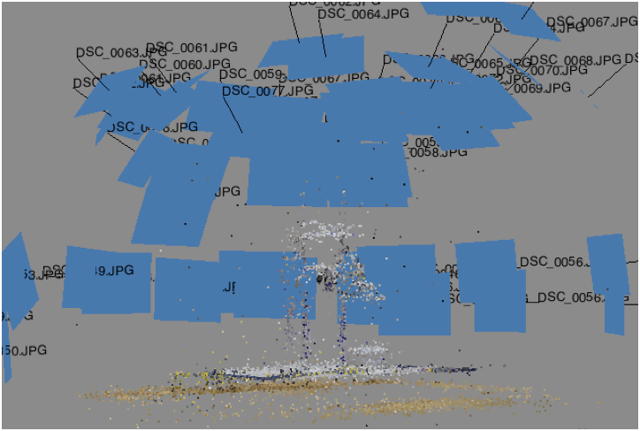
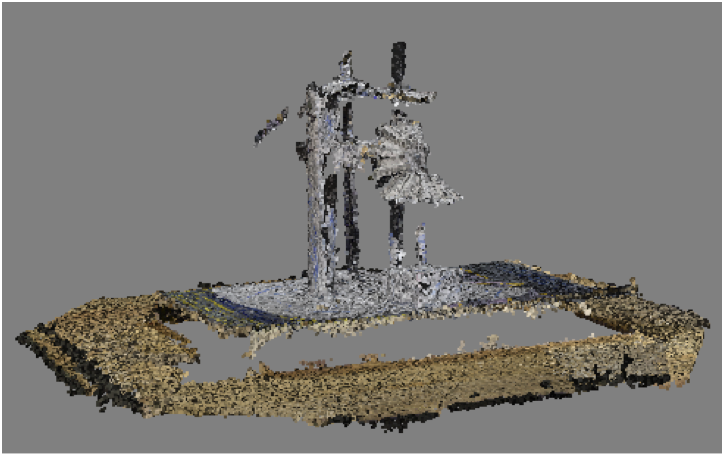
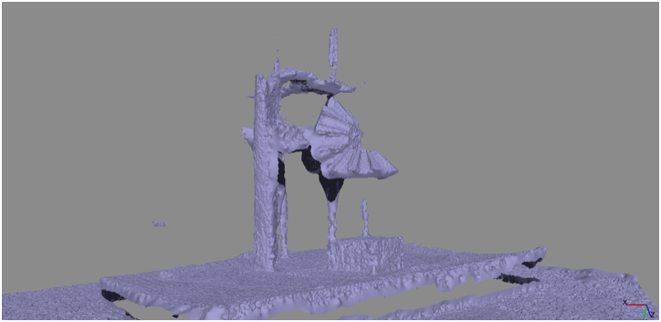
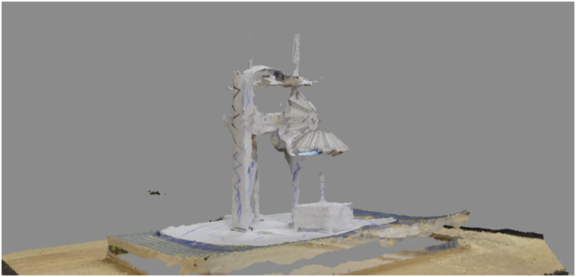

What is photogrammetry?

From Wikipedia: "Photogrammetry is the science of making measurements from photographs, especially for recovering the exact positions of surface points."

We’re going to use photographs to measure the distance between certain points on your object. With a camera, you’ll take a series of 2D images of your object and use them to create a 3D model. The photographs will be captured from different positions and angles around your object. Then, using Agisoft Photoscan, we’ll stitch together chunks of 2D images into 3D meshes with texture. 

Things to remember while taking your photographs:

* The type of camera you use does not matter. In fact, mirrorless cameras that operate with fewer megapixels (for example, smartphone cameras) often work better.
* Lenses are also irrelevant (although, you should avoid fisheye or wide angle lenses).
* Wherever possible, use a low ISO (say, 100 or 200), to avoid noise and grain in your photos.
* If your camera has a manual mode, then consider using it.

* When working with the natural or built environment, you might encounter hiccups with repetitive, shiny, plain, or reflective surfaces.

* Avoid taking photos with other objects in the frame, as stitching programs will try to incorporate these objects into the model.

* It's nearly impossible to reconstruct moving objects, people, or animals.

* Overcast skies are ideal. Generally speaking, light and shadow will influence the reconstruction process.

* Shoot frequently around a subject, with at least two consistent angles (e.g., high and low).

* Don't use a flash.

* Where possible, create 80% overlap across images. In many ways, such redundancy is conducive to making meshes. 

* Start with a simple project, say, a batch of 25 images. Often, you don't need a lot of data to create a compelling mesh.

Before feeding your images into Photoscan:

* Before adding photos to Photoscan, consider batch processing them into two chunks: one with zero contrast, and one with maximum contrast. Here, Camera Raw in Bridge or Photoshop is a helpful tool.

Photoscan workflow in short:

1.    Add cameras

2.    Align cameras

3.   Generate dense cloud

4.    Build mesh

5.    Build texture

Photoscan Workflow in detail: 

1. Click the "add photos" button on the left (icon is a plus sign with a deck of images behind it).

2. Select all photos you want in your batch and click open (you will then see the number of cameras, or photos, in your workspace on the left).

3. If you wish, then you can select images on the right/bottom and use the intelligent scissors to create contours (removing the background) in individual images.

4. In the menu, select "workflow," "align photos," with medium or high accuracy and --- if the object is static --- uncheck "constrain."

5. Once processed, you'll see all of your cameras arranged in a sequence; click on a camera to see it.

6. If you want to reduce the region (or bounding box) around your cameras, click "resize region" (the icon looks like crosshairs over a square). Resize the box with your mouse.

7. Now return to "workflow" and select "build dense cloud." To save processing time, you can select "medium" quality.

8. Once the cloud is constructed, return to "workflow" again and "build mesh" (consider these settings: arbitrary, dense cloud, and medium). This process will consume a bit of time.

9. If you'd like to remove faces from the model, then use the rectangle tool (icon is a square made of dashes) to select unwanted areas and then click the delete selection button (icon is an x).

10. For the last key step, under "workflow," select "build texture."

11. With the mesh and texture constructed, in the menu try Tools > Mesh > Map UVs. (UVW is the coordinate system for meshes. U and V are essentially X and Y, respectively.) This tool will rendering your 3D mesh into a series of faces, expressed as a 2D image. It will also give you some important data about your mesh, including density data.

12. If you want to export your model as a PDF, TIFF, JPG, OBJ (for Rhino or Blender), or 3DS (for SketchUp), then try File > Export.

Photoscan workflow in action: 

The first step in the Photoscan process is photo alignment, where you pinpoint areas that need more or less focus. Here, you can experiment with different combinations of camera points to achieve your desired collection of photographs. This step is especially useful when Photoscan attempts to absorb unwanted sections/objects of your photographs into the model (like other objects in the frame, walls, patterns, harsh light spots, etc).

In the second step, you’re going to build a dense point cloud, where you resize or rotate sections of your object. This step is useful if a particular section of the model has been detached or is the wrong size. If you like, you can also take this opportunity to alter your model. Rather than attempting to directly replicate your original object, you can rearrange, resize, or flip different sections to modify your model. 

Next, you’ll build a mesh and Photoscan will adapt your changes into an accurate model. 

Finally, it’s time to add texture. This step accounts for Photoscan’s ability to replicate objects with such accuracy.

